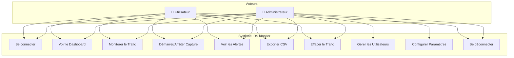
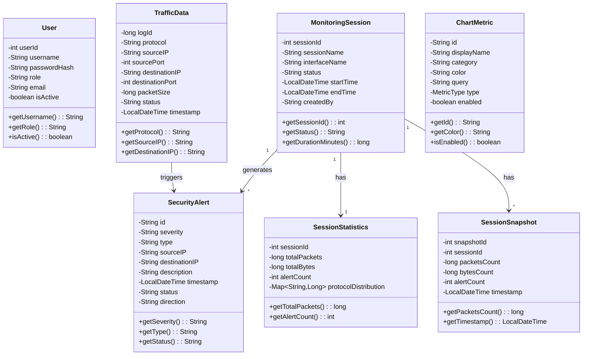
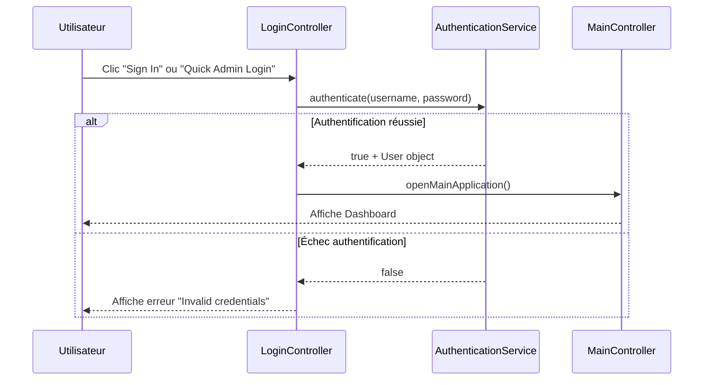
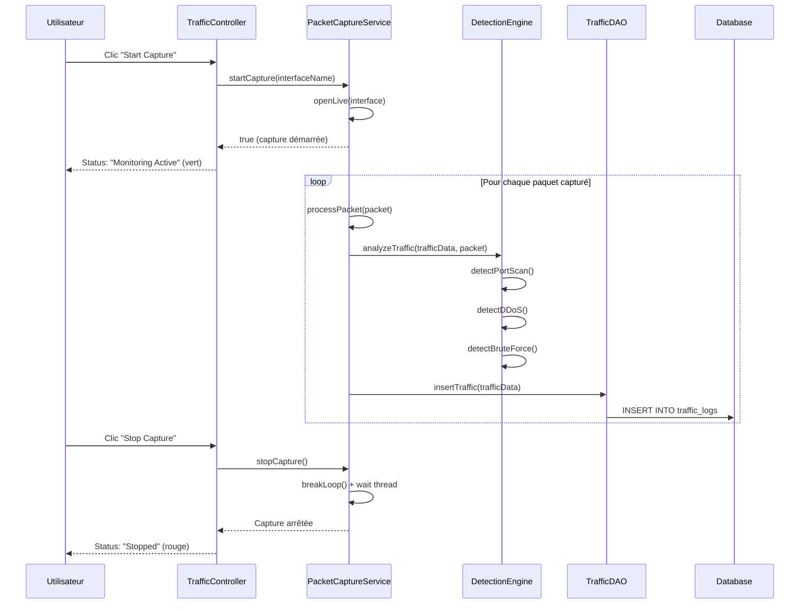
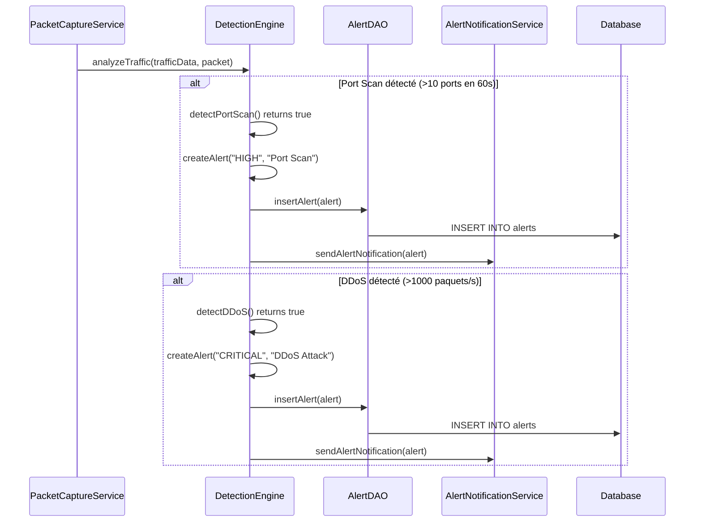
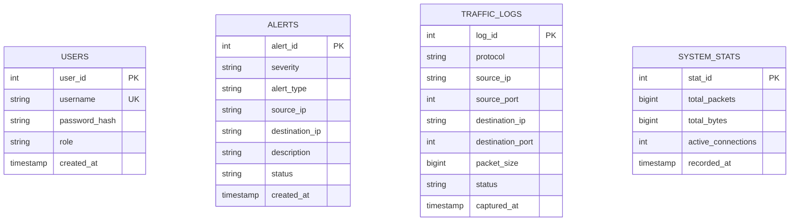

# IDS Monitor - Documentation UML

## 📋 Résumé du Projet

**IDS Monitor** est un système de détection d'intrusions (Intrusion Detection System) développé en Java/JavaFX qui permet de:
- Capturer et analyser le trafic réseau en temps réel
- Détecter les menaces (Port Scan, DDoS, Brute Force, SQL Injection, XSS)
- Gérer les alertes de sécurité
- Authentifier les utilisateurs (Admin, User)

---

## 1. Diagramme de Cas d'Utilisation (Use Case)



### Tableau des Cas d'Utilisation

| ID | Cas d'Utilisation | Admin | User |
|----|-------------------|-------|------|
| UC1 | Se connecter | ✅ | ✅ |
| UC2 | Voir le Dashboard | ✅ | ✅ |
| UC3 | Monitorer le Trafic | ✅ | ✅ |
| UC4 | Démarrer/Arrêter Capture | ✅ | ✅ |
| UC5 | Voir les Alertes | ✅ | ✅ |
| UC6 | Exporter CSV | ✅ | ✅ |
| UC7 | Effacer le Trafic | ✅ | ✅ |
| UC8 | Gérer les Utilisateurs | ✅ | ❌ |
| UC9 | Configurer Paramètres | ✅ | ❌ |
| UC10 | Se déconnecter | ✅ | ✅ |

---

## 2. Diagramme de Classes



### Relations entre Classes

| Classe Source | Relation | Classe Cible | Description |
|---------------|----------|--------------|-------------|
| Main | utilise | AuthenticationService | Initialisation au démarrage |
| Main | utilise | DatabaseManager | Connexion BD au démarrage |
| TrafficController | utilise | PacketCaptureService | Capture des paquets |
| TrafficController | utilise | TrafficDAO | Accès aux données trafic |
| PacketCaptureService | utilise | DetectionEngine | Analyse des paquets |
| DetectionEngine | utilise | AlertDAO | Sauvegarde des alertes |
| TrafficDAO | utilise | DatabaseManager | Accès BD |

---

## 3. Diagrammes de Séquence

### 3.1 Séquence: Authentification



### 3.2 Séquence: Capture de Trafic



### 3.3 Séquence: Détection de Menace



---

## 4. Architecture du Système

```
┌─────────────────────────────────────────────────────────────┐
│                    PRÉSENTATION (JavaFX)                     │
│  ┌──────────┐ ┌──────────┐ ┌──────────┐ ┌──────────────────┐│
│  │  Login   │ │Dashboard │ │ Traffic  │ │     Alerts       ││
│  │Controller│ │Controller│ │Controller│ │   Controller     ││
│  └──────────┘ └──────────┘ └──────────┘ └──────────────────┘│
└─────────────────────────────────────────────────────────────┘
                              │
┌─────────────────────────────────────────────────────────────┐
│                    SERVICES (Singleton)                      │
│  ┌────────────────┐ ┌────────────────┐ ┌──────────────────┐ │
│  │Authentication  │ │ PacketCapture  │ │   Detection      │ │
│  │   Service      │ │   Service      │ │    Engine        │ │
│  └────────────────┘ └────────────────┘ └──────────────────┘ │
└─────────────────────────────────────────────────────────────┘
                              │
┌─────────────────────────────────────────────────────────────┐
│                    ACCÈS DONNÉES (DAO)                       │
│  ┌──────────┐ ┌──────────┐ ┌──────────┐ ┌──────────────────┐│
│  │TrafficDAO│ │ AlertDAO │ │ UserDAO  │ │   AccountDAO     ││
│  └──────────┘ └──────────┘ └──────────┘ └──────────────────┘│
│                    ┌──────────────────┐                      │
│                    │ DatabaseManager  │                      │
│                    │   (HikariCP)     │                      │
│                    └──────────────────┘                      │
└─────────────────────────────────────────────────────────────┘
                              │
┌─────────────────────────────────────────────────────────────┐
│                    BASE DE DONNÉES                           │
│                      PostgreSQL                              │
│  ┌──────────┐ ┌──────────┐ ┌──────────┐ ┌──────────────────┐│
│  │  users   │ │  alerts  │ │ traffic  │ │  system_stats    ││
│  │          │ │          │ │  _logs   │ │                  ││
│  └──────────┘ └──────────┘ └──────────┘ └──────────────────┘│
└─────────────────────────────────────────────────────────────┘
```

---

## 5. Modèle de Données (Schéma BD)



---

## 6. Technologies Utilisées

| Catégorie | Technologie | Version |
|-----------|-------------|---------|
| Langage | Java | 23 |
| Framework UI | JavaFX | 21.0.6 |
| Base de données | PostgreSQL | 16 |
| Pool de connexions | HikariCP | 5.1.0 |
| Capture réseau | Pcap4J | 1.8.2 |
| Build | Maven | 3.9 |
| Email | JavaMail API | 1.6.2 |
| Logging | SLF4J | 2.0.9 |

---

## 7. Résumé Bref du Projet

> **IDS Monitor** est une application de monitoring réseau développée en Java/JavaFX qui utilise la bibliothèque **Pcap4J** pour capturer le trafic réseau en temps réel. L'application analyse chaque paquet pour détecter des menaces de sécurité comme les **scans de ports**, les **attaques DDoS**, et les **tentatives de brute force**.
>
> L'architecture suit le pattern **MVC** (Model-View-Controller) avec une couche de services utilisant le pattern **Singleton** pour garantir une instance unique des services critiques. Les données sont stockées dans **PostgreSQL** via le pattern **DAO** (Data Access Object).
>
> Le système supporte trois rôles d'utilisateurs: **Administrateur** (accès complet), **Utilisateur** (monitoring sans admin), et **Viewer** (lecture seule).
> 

